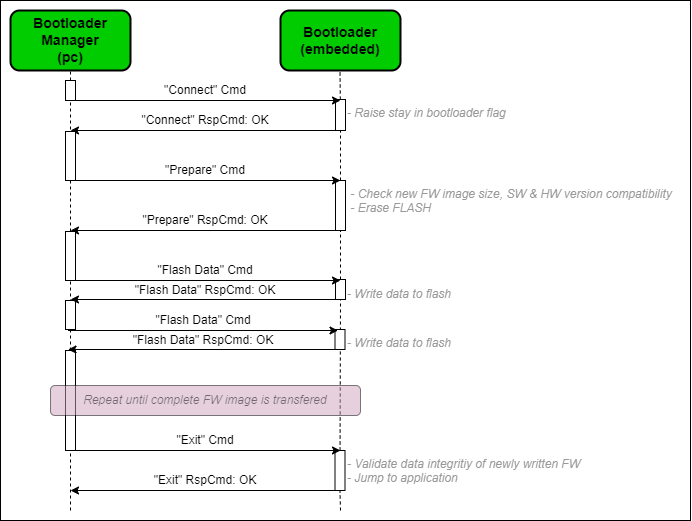
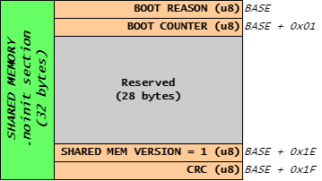
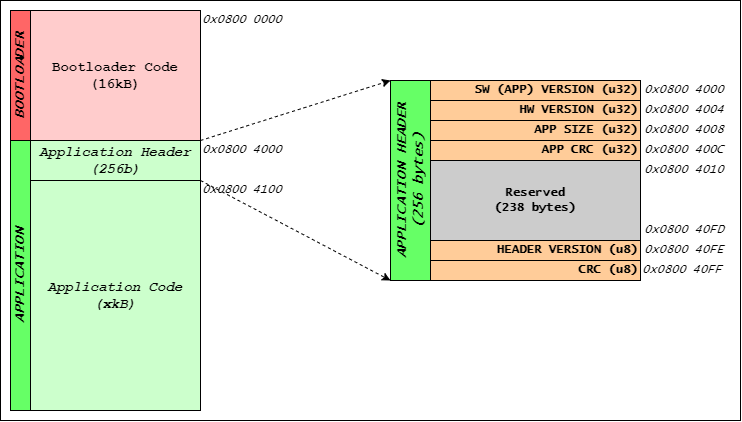
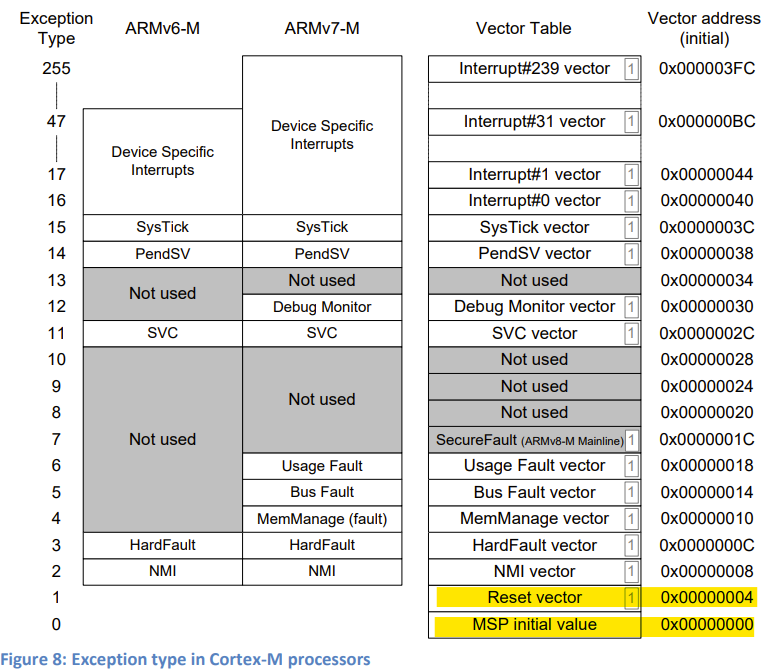

# **Boot**
Bootloader implementation in C code for general use in embedded systems.


## **Bootloader Interface**
Bootloader has custom, lightweight and pyhsical layer agnostics communication interface. Detailed specifications of interface can be found in [Bootloader_Interface_Specifications.xlsx](doc/Bootloader_Interface_Specifications.xlsx).

## **Bootloader Sequence**




## **Bootloader<->Application Communication**
Bootloader and application data exchange takes over special RAM section defined as non-initialized aka. *.noinit* section. 

Following data is being exhange between bootloader and application:
 1. **Boot reason**: Booting reason, to tell bootloader what actions shall be taken, either loading new image via PC or external FLASH, or just jump to application
 2. **Boot counter**: Safety/Reliablity counter that gets incerement on each boot by bootloader and later cleared by application after couple of minutes of stable operation

Shared memory space V1 is 32 bytes in size with following data structure:


Setup linker script for common shared memory between bootloader and application by first defining new memory inside RAM called ***SHARED_MEM*** region:

```
/* Memories definition */
MEMORY
{
  RAM    		(xrw)    	: ORIGIN = 0x20000000, LENGTH = 128K - 0x20
  
  /* Reserve SHARED_MEM memory region at the end of RAM */
  /* Region is used for app<->boot inteface and it is 32 bytes in size */
  SHARED_MEM	(rw)		: ORIGIN = 0x20000000 + 128K - 0x20, LENGTH = 0x20
  
  /** Bootloader flash memory space */
  BOOT_FLASH    (rx)   		: ORIGIN = 0x08000000, LENGTH = 32K
  
  /** Application flash memory space */
  APP_FLASH    	(rx)   		: ORIGIN = 0x08008000, LENGTH = 512K-32K
}
```

Afterwards a ***shared_mem*** section needs to be defined that will fill in symbols to *SHARED_MEM* space:

```
/* No init section for app<->boot interface */
.noinit (NOLOAD):
{
/* place all symbols in input sections that start with .shared_mem */
KEEP(*(*.shared_mem*))
} > SHARED_MEM    
```

Change bootloader configuration for shared memory linker directive according to defined section in linker file inside *boot_cfg.h*:

```C
/**
 *  Shared memory section directive for linker
 */
#define __BOOT_CFG_SHARED_MEM__                	__attribute__((section(".shared_mem")))
```

More info about no-init memory: https://interrupt.memfault.com/blog/noinit-memory 

## **Validation of new application image**
Bootloader support up to four different validation criteria for new application before update process can initiate:
 1. Application size check
 2. Application SW compatibility check
 3. Application HW compatibility check
 4. Downgrade protection

### **1. Application size check**
Bootloader can check if new application will fit into reserved application flash by defining maximum application size and enabling app size check.

Firmware size check configuration in ***boot_cfg.h***:
```C
/**
 *      Complete (maximum) application size
 *
 *  Unit: byte
 */
#define BOOT_CFG_APP_SIZE                       (( 512U - 32U ) * 1024U )

/**
 *      Enable/Disable new firmware size check
 *
 * @note    At prepare command bootloader will check if new firmware app
 *          can be fitted into "BOOT_CFG_APP_SIZE" space, if that macro
 *          is enabled!
 */
#define BOOT_CFG_FW_SIZE_CHECK_EN              ( 1 )
```

### **2. Aplication SW version compatibility check**
New application SW version compatibility can be checked if module is configurted to do so:
 - *BOOT_CFG_FW_VER_CHECK_EN*: When enabled, it prevents to upload application that is not suitable for current bootloader version according to Release Management. Limit new application version on the top.
 - *BOOT_CFG_FW_DOWNGRADE_EN*: When enabled, it prevents uploading older application that is currently running. Limit new application version on the bottom. 

Firmware compatibility configuration in ***boot_cfg.h***:
```C
/**
 *      Enable/Disable new firmware version compatibility check
 */
#define BOOT_CFG_FW_VER_CHECK_EN               ( 0 )

/**
 *      New firmware compatibility value
 *
 *  @note   New firmware version is compatible up to
 *          version specified in following defines.
 */
#if ( 1 == BOOT_CFG_FW_VER_CHECK_EN )
    #define BOOT_CFG_FW_VER_MAJOR               ( 1 )
    #define BOOT_CFG_FW_VER_MINOR               ( 0 )
    #define BOOT_CFG_FW_VER_DEVELOP             ( 0 )
    #define BOOT_CFG_FW_VER_TEST                ( 0 )
#endif

/**
 *      Enable/Disable firmware downgrade
 *
 * @note    At prepare command bootloader will check if new firmware app
 *          has higher version than current, if that macro is enabled!
 */
#define BOOT_CFG_FW_DOWNGRADE_EN                ( 0 )
```

### **3. New aplication HW version compatibility check**
Bootloader can check for hardware compatibility with new application image and can prevent uploading of application if not suitable for given HW version of the system. Each application image shall have a HW version embedded into application header and that information is then used to check for HW compatibility.

Hardware compatibility configuration in ***boot_cfg.h***:
```C
/**
 *      Enable/Disable new firmware version compatibility check
 */
#define BOOT_CFG_HW_VER_CHECK_EN                ( 0 )

/**
 *      New firmware hardware compatibility value
 *
 *  @note   New firmware hardware version is compatible up to
 *          version specified in following defines.
 */
#if ( 1 == BOOT_CFG_HW_VER_CHECK_EN )
    #define BOOT_CFG_HW_VER_MAJOR               ( 1 )
    #define BOOT_CFG_HW_VER_MINOR               ( 0 )
    #define BOOT_CFG_HW_VER_DEVELOP             ( 0 )
    #define BOOT_CFG_HW_VER_TEST                ( 0 )
#endif
```

### **4. Downgrade protection**
Bootloader can detect & prevent upgrading with older application as it currently running by enabling *BOOT_CFG_FW_DOWNGRADE_EN*.

Downgrade enable/disable configuration in ***boot_cfg.h***:
```C
/**
 *      Enable/Disable firmware downgrade
 *
 * @note    At prepare command bootloader will check if new firmware app
 *          has higher version than current, if that macro is enabled!
 */
#define BOOT_CFG_FW_DOWNGRADE_EN                ( 1 )
```

## **Dependencies**

### **1. Flash memory map**
Bootloader expect predefined application binary code as shown in picture bellow. 



### **2. Application header**
Application code must have a ***Application Header*** in order to validate data integritiy of image.

### **3. Revision module**
[Revision module](https://github.com/GeneralEmbeddedCLibraries/revision) provides information of application header.

### **4. FSM module**
[FSM module](https://github.com/GeneralEmbeddedCLibraries/fsm) provides state transitions and timings spend in each state of bootloader.


## **Limitations**

### **1. ARM Cortex-M family**
Current implementation of bootloader **supports only ARM Cortex-M** processor family, as it expects stack pointer to be first 4 bytes of binary file, follow by reset vector. 

Picture taken from [*ARM® Cortex®-M for Beginners: An overview of the ARM Cortex-M processor family and comparison*](https://community.arm.com/arm-community-blogs/b/architectures-and-processors-blog/posts/white-paper-cortex-m-for-beginners-an-overview-of-the-arm-cortex-m-processor-family-and-comparison):



## **General Embedded C Libraries Ecosystem**
In order to be part of *General Embedded C Libraries Ecosystem* this module must be placed in following path: 

```
root/middleware/boot/boot/"module_space"
```

## **API**
| API Functions | Description | Prototype |
| --- | ----------- | ----- |
| **boot_init** | Initialization of Bootloader module | boot_status_t boot_init(void) |


## **Usage**

**GENERAL NOTICE: Put all user code between sections: USER CODE BEGIN & USER CODE END!**

1. Copy template files to root directory of module.
2. Configure Boot module for application needs. Configuration options are following:

| Configuration | Description |
| --- | --- |
| **BOOT_CFG_FW_SIZE_CHECK_EN** 			| Enable/Disable new firmware size check |
