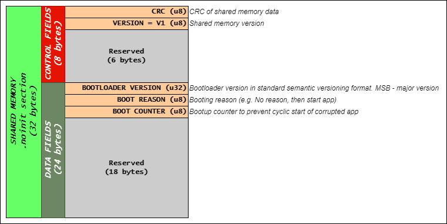
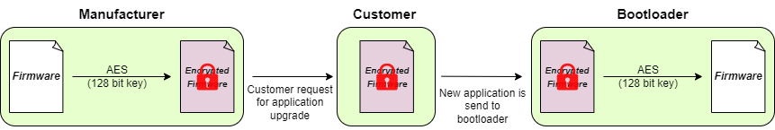
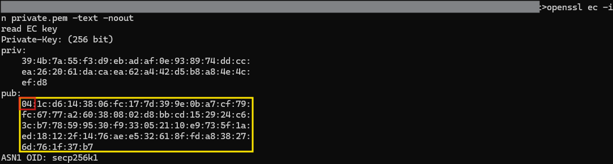
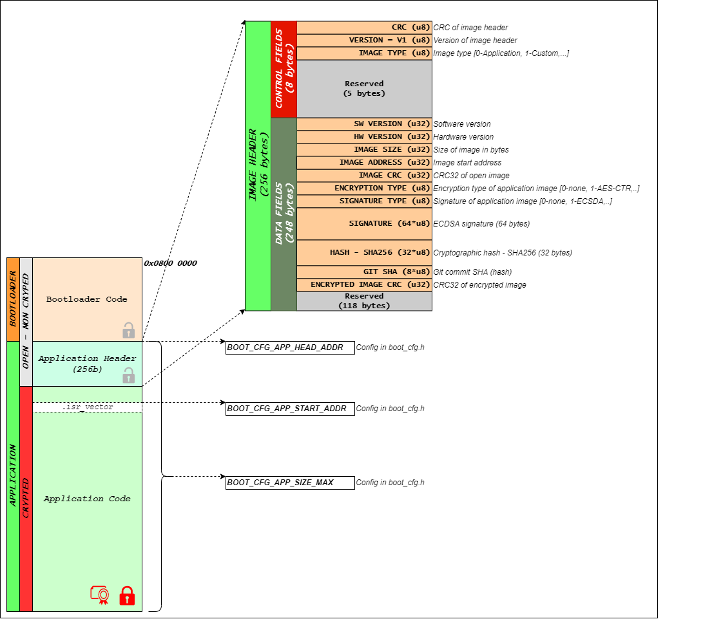

# **Boot**
Bootloader implementation in C code for general use in embedded systems.

Main features of bootloader:
 - Multiple application validation checks
    + Application size check
    + Application SW compatibility check
    + Application HW compatibility check
    + Downgrade protection 
 - ECDSA Digital signature validation
 - AES-CTR Image encryption
 - Communication agnostics
 - Sharing data between bootloader and application via *.noinit* RAM section
 - Detection of reboot loop due to corrupted application
 - Back-door entry to bootloader
 - Jump to application timeout

## **Bootloader Interface**
Bootloader has custom, lightweight and pyhsical layer agnostics communication interface. Detailed specifications of interface can be found in [Bootloader_Interface_Specifications.xlsx](doc/Bootloader_Interface_Specifications.xlsx).

## **Bootloader Sequence**


## **Bootloader<->Application Communication**
Bootloader and application data exchange takes over special RAM section defined as non-initialized aka. *.noinit* section. 

Following data is being exhange between bootloader and application:
 1. **Bootloader version**: Software version of bootloader
 2. **Boot reason**: Booting reason, to tell bootloader what actions shall be taken, either loading new image via PC or external FLASH, or just jump to application
 3. **Boot counter**: Safety/Reliablity counter that gets incerement on each boot by bootloader and later cleared by application after couple of minutes of stable operation

Shared memory space is 32 bytes in size with following data structure:


Setup linker script for common shared memory between bootloader and application by first defining new memory inside RAM called ***SHARED_MEM*** region:

```
/* Memories definition */
MEMORY
{
  RAM    		(xrw)    	: ORIGIN = 0x20000000, LENGTH = 128K - 0x20
  
  /* Reserve SHARED_MEM memory region at the end of RAM */
  /* Region is used for app<->boot inteface and it is 32 bytes in size */
  SHARED_MEM	(rw)		: ORIGIN = 0x20000000 + 128K - 0x20, LENGTH = 0x20
  
  /** Bootloader flash memory space */
  BOOT_FLASH    (rx)   		: ORIGIN = 0x08000000, LENGTH = 32K
  
  /** Application flash memory space */
  APP_FLASH    	(rx)   		: ORIGIN = 0x08008000, LENGTH = 512K-32K
}
```

Afterwards a ***shared_mem*** section needs to be defined that will fill in symbols to *SHARED_MEM* space:

```
/* No init section for app<->boot interface */
.noinit (NOLOAD):
{
/* place all symbols in input sections that start with .shared_mem */
KEEP(*(*.shared_mem*))
} > SHARED_MEM    
```

Change bootloader configuration for shared memory linker directive according to defined section in linker file inside *boot_cfg.h*:

```C
/**
 *  Shared memory section directive for linker
 */
#define __BOOT_CFG_SHARED_MEM__                	__attribute__((section(".shared_mem")))
```

More info about no-init memory: https://interrupt.memfault.com/blog/noinit-memory 

## **Validation of new application image**
Bootloader support up to four different validation criteria for new application before update process can initiate:
 1. Application size check
 2. Application SW compatibility check
 3. Application HW compatibility check
 4. Downgrade protection
 5. Firmware digital signature (ECDSA)

### **1. Application size check**
Bootloader can check if new application will fit into reserved application flash by defining maximum application size and enabling app size check.

Firmware size check configuration in ***boot_cfg.h***:
```C
/**
 *      Complete (maximum) application size
 *
 *  Unit: byte
 */
#define BOOT_CFG_APP_SIZE                       (( 512U - 32U ) * 1024U )

/**
 *      Enable/Disable new firmware size check
 *
 * @note    At prepare command bootloader will check if new firmware app
 *          can be fitted into "BOOT_CFG_APP_SIZE" space, if that macro
 *          is enabled!
 */
#define BOOT_CFG_FW_SIZE_CHECK_EN              ( 1 )
```

### **2. Aplication SW version compatibility check**
New application SW version compatibility can be checked if module is configurted to do so:
 - *BOOT_CFG_FW_VER_CHECK_EN*: When enabled, it prevents to upload application that is not suitable for current bootloader version according to Release Management. Limit new application version on the top.
 - *BOOT_CFG_FW_DOWNGRADE_EN*: When enabled, it prevents uploading older application that is currently running. Limit new application version on the bottom. 

Firmware compatibility configuration in ***boot_cfg.h***:
```C
/**
 *      Enable/Disable new firmware version compatibility check
 */
#define BOOT_CFG_FW_VER_CHECK_EN               ( 0 )

/**
 *      New firmware compatibility value
 *
 *  @note   New firmware version is compatible up to
 *          version specified in following defines.
 */
#if ( 1 == BOOT_CFG_FW_VER_CHECK_EN )
    #define BOOT_CFG_FW_VER_MAJOR               ( 1 )
    #define BOOT_CFG_FW_VER_MINOR               ( 0 )
    #define BOOT_CFG_FW_VER_DEVELOP             ( 0 )
    #define BOOT_CFG_FW_VER_TEST                ( 0 )
#endif

/**
 *      Enable/Disable firmware downgrade
 *
 * @note    At prepare command bootloader will check if new firmware app
 *          has higher version than current, if that macro is enabled!
 */
#define BOOT_CFG_FW_DOWNGRADE_EN                ( 0 )
```

### **3. New aplication HW version compatibility check**
Bootloader can check for hardware compatibility with new application image and can prevent uploading of application if not suitable for given HW version of the system. Each application image shall have a HW version embedded into application header and that information is then used to check for HW compatibility.

Hardware compatibility configuration in ***boot_cfg.h***:
```C
/**
 *      Enable/Disable new firmware version compatibility check
 */
#define BOOT_CFG_HW_VER_CHECK_EN                ( 0 )

/**
 *      New firmware hardware compatibility value
 *
 *  @note   New firmware hardware version is compatible up to
 *          version specified in following defines.
 */
#if ( 1 == BOOT_CFG_HW_VER_CHECK_EN )
    #define BOOT_CFG_HW_VER_MAJOR               ( 1 )
    #define BOOT_CFG_HW_VER_MINOR               ( 0 )
    #define BOOT_CFG_HW_VER_DEVELOP             ( 0 )
    #define BOOT_CFG_HW_VER_TEST                ( 0 )
#endif
```

### **4. Downgrade protection**
Bootloader can detect & prevent upgrading with older application as it currently running by enabling *BOOT_CFG_FW_DOWNGRADE_EN*.

Downgrade enable/disable configuration in ***boot_cfg.h***:
```C
/**
 *      Enable/Disable firmware downgrade
 *
 * @note    At prepare command bootloader will check if new firmware app
 *          has higher version than current, if that macro is enabled!
 */
#define BOOT_CFG_FW_DOWNGRADE_EN                ( 1 )
```

### **5. Digital signature - ECDSA**
Bootloader can detect invalid image by checking its digital signature by enabling *BOOT_CFG_DIGITAL_SIGN_EN*. 

Using Elliptic Curve Digital Signature Algorithm (ECDSA) with a help of external libraries:
 - [micro_ecc](https://github.com/kmackay/micro-ecc)
 - [CIFRA](https://github.com/ctz/cifra)

Digital signature enable/disable configuration in ***boot_cfg.h***:
```C
/**
 *      Enable/Disable new firmware version digital signature check
 *
 * @note    At prepare command bootloader will check for valid
 *          digital signature based on hash and signature field in
 *          new image header.
 */
#define BOOT_CFG_DIGITAL_SIGN_EN                ( 0 )
```

## **Catching reboot loops**
In order to prevent repetative re-booting of corrupted application, bootloader can be configured to detect such an anomaly. This is done with following logic:
 1. On boot, the bootloader increments a boot counter (boot counter is part of a shared memory),
 2. After the application has been validated as stable (depends on validation criteria, e.g. 1 minute of working), the application resets the counter to 0,
 3. If the counter gets to configured limit (via *BOOT_CFG_BOOT_CNT_LIMIT*), the bootloader does not start the app and wait for new application 

Configuring boot counter in ***boot_cfg.h***:
```C
/**
 *      Enable/Disable boot counting check
 *
 * @note    Boot count is safety mechanism build into bootloader
 *          in order to detect malfunctional application!
 */
#define BOOT_CFG_APP_BOOT_CNT_CHECK_EN          ( 0 )

/**
 *      Boot counts limit
 *
 *  @note   After boot count reaches that limit it will
 *          not enter application! Bootloader will declare
 *          a faulty app and will request new application!
 */
#if ( 1 == BOOT_CFG_APP_BOOT_CNT_CHECK_EN )
    #define BOOT_CFG_BOOT_CNT_LIMIT               ( 5 )
#endif
```

## **Back-door entry to bootloader**
Back-door entry to bootloader is implemented as simple waiting for "Connect" command from Bootloader Manager (typical PC application). This safety mechanism enables entering bootloader at power-on or reset event, in case application is corrupted and thus prevents entering bootloader from application. 

Configuration of back-door entry to bootloader in ***boot_cfg.h***:
```C
/**
 *      Bootloader back-door entry timeout
 *
 * @note    Wait specified amount of time before entering application
 *          code at bootloader startup if application is validated OK.
 *
 *          To disable waiting set to timeout to 0.
 *
 *  Unit: ms
 */
#define BOOT_CFG_WAIT_AT_STARTUP_MS             ( 100U )
```

## **Jump to application timeout**
In case program ends up in bootloader with no requests from Bootloader Manager (PC app) and there is a valid application, it will timeout and start the application.

Configuration of idle timeout in ***boot_cfg.h***:
```C
/**
 *  Jump to application (if valid) if communication idle
 *  for more than this value of timeout
 *
 *  Unit: ms
 */
#define BOOT_CFG_JUMP_TO_APP_TIMEOUT_MS         ( 5000U )
```

## **Application firmware image cryptography**
One of the purposes for firmware image cryption is to prevent: 
 - Storing of intellectual property (IP)  
 - Unauthorized firmware modification and loading

Firmware upgrade procedure using crypted image is shown below:



In case application image is encrypted, bootloader must first decrypt it and then store to the internal flash. To use encrytpion option enable crypto switch in ***boot_cfg.h***:
```C
/**
 *  Enable/Disable firmware binary encryption
 */
#define BOOT_CFG_CRYPTION_EN                    ( 1 )
```

After that, cryptographic library needs to be initilized and that must be done in ***boot_if.c***. Example of using [STM32 CMOX](https://wiki.st.com/stm32mcu/wiki/Security:Introduction_to_the_cryptographic_library_with_STM32):
```C
/**
 *  AES CTR context handle
 */
static cmox_ctr_handle_t g_ctr_ctx = {0};

/**
 *  AES cipher context handle
 */
static cmox_cipher_handle_t * gp_cipher_ctx = NULL;

/**
 *  AES CTR Encryption Key
 */
static const uint8_t gu8_key[] = { 0x2b, 0x7e, 0x15, 0x16, 0x28, 0xae, 0xd2, 0xa6, 0xab, 0xf7, 0x15, 0x88, 0x09, 0xcf, 0x4f, 0x3c };

/**
 *  AES CTR Initial Vector (IV) Key
 */
static const uint8_t gu8_iv[] = { 0x00, 0x01, 0x02, 0x03, 0x04, 0x05, 0x06, 0x07, 0x08, 0x09, 0x0a, 0x0b, 0x0c, 0x0d, 0x0e, 0x0f };

////////////////////////////////////////////////////////////////////////////////
/**
*       Initialize cryptographic library
*
* @return       status  - Status of operation
*/
////////////////////////////////////////////////////////////////////////////////
static boot_status_t bool_if_crypto_init(void)
{
  boot_status_t status = eBOOT_OK;

  // Initialize cryptographic library
  if ( CMOX_INIT_SUCCESS != cmox_initialize( NULL ))
  {
      status = eBOOT_ERROR;
  }

  // Construct a cipher context
  gp_cipher_ctx = cmox_ctr_construct( &g_ctr_ctx, CMOX_AESFAST_CTR_DEC );

  // Check for construction creation
  if ( NULL == gp_cipher_ctx )
  {
      status = eBOOT_ERROR;
  }

  // Initialize the cipher context
  if ( CMOX_CIPHER_SUCCESS != cmox_cipher_init( gp_cipher_ctx ))
  {
      status = eBOOT_ERROR;
  }

  // Setup decryption key
  if ( CMOX_CIPHER_SUCCESS != cmox_cipher_setKey( gp_cipher_ctx, gu8_key, sizeof( gu8_key )))
  {
      status = eBOOT_ERROR;
  }

  // Setup Initilization Vector (IV)
  if ( CMOX_CIPHER_SUCCESS != cmox_cipher_setIV( gp_cipher_ctx, gu8_iv, sizeof( gu8_iv )))
  {
      status = eBOOT_ERROR;
  }

  return status;
}
```

Next decryption function needs to be implemented inside ***boot_if.c***. Example:
```C
////////////////////////////////////////////////////////////////////////////////
/**
*       Decrypt flash data received over communication
*
* @param[in]    p_crypt_data    - Pointer to crypted flash data
* @param[out]   p_decrypt_data  - Pointer to decrypted flash data
* @param[in]    size            - Size of data to decrypt
* @return       void
*/
////////////////////////////////////////////////////////////////////////////////
void boot_if_decrypt_data(const uint8_t * const p_crypt_data, uint8_t * const p_decrypt_data, const uint32_t size)
{
    // USER CODE BEGIN...

    (void) cmox_cipher_append( gp_cipher_ctx, p_crypt_data, size, p_decrypt_data, NULL );

    // USER CODE END...
}
```

And finaly, cryptographic library reset function must be implemented, also in ***boot_if.c***. Example:
```C
////////////////////////////////////////////////////////////////////////////////
/**
*       Reset cryto engine
*
* @return       void
*/
////////////////////////////////////////////////////////////////////////////////
void boot_if_decrypt_reset(void)
{
    // USER CODE BEGIN...

    //Cleanup the handle
    (void) cmox_cipher_cleanup( gp_cipher_ctx );

    // USER CODE END...
}
```

As bootloader expects crypted binary image, plain binary needs to be crypted using the same cryptography method as for decrypting. Following Python snipped provides compatible encryption for given example:
```Python
import binascii
from Crypto.Cipher import AES
from Crypto.Random import get_random_bytes
from Crypto.Util import Counter

# ===============================================================================
# @brief  Crypt plaing data to AES with key and initial vector
#
# @param[in]    plain_data      - Inputed non-cryptic data
# @return       crypted_data    - Outputed cryptic data
# ===============================================================================
def aes_encode(plain_data):

    # AES Key and IV
    key = b"\x2b\x7e\x15\x16\x28\xae\xd2\xa6\xab\xf7\x15\x88\x09\xcf\x4f\x3c"
    iv = b"\x00\x01\x02\x03\x04\x05\x06\x07\x08\x09\x0a\x0b\x0c\x0d\x0e\x0f"

    # Create cipher
    ctr = Counter.new(128, initial_value=int(binascii.hexlify(iv), 16))
    cipher = AES.new(key, AES.MODE_CTR, counter=ctr)

    # Encode
    return cipher.encrypt( bytearray( plain_data ))
```

**NOTICE: Don't forget to change AES Key and Initial Vector (IV) for your end application!**


## **Digital signature**
 - Digital signature guarantees that the code has not been altered or tampered with during transmission
 - Digital signatures ensure that only legitimate, trusted firmware can be uploaded to a device -> Improvement over current implementation
 - Using ECDSA (Elliptic Curve Digital Signature Algoritm) to check signature

Using OpenSSL for generate private key:
```
openssl ecparam -name secp256k1 -genkey -noout -out private.pem
```

To generate public key out of private:
```
openssl ec -in private.pem -pubout -out public.pem
```

To get nice overview of private and public key:
```
openssl ec -in private.pem -text -noout
```

This will output private and public key to output:
```
openssl ec -in private.pem -text -noout
```




Convert public key value that to C code and paste it into ***boot_if.c*** interface file:
```C
/**
 *      Public key
 *
 *  @note   Generated with OpenSSL tool!
 */
static const uint8_t gu8_public_key[64] =
{
    0x1c, 0xd6, 0x14, 0x38, 0x06, 0xfc, 0x17, 0x7d, 0x39, 0x9e, 0x0b, 0xa7, 0xcf,
    0x79, 0xfc, 0x67, 0x77, 0xa2, 0x60, 0x38, 0x08, 0x02, 0xd8, 0xbb, 0xcd, 0x15,
    0x29, 0x24, 0xc6, 0x3c, 0xb7, 0x78, 0x59, 0x95, 0x30, 0xf9, 0x33, 0x05, 0x21,
    0x10, 0xe9, 0x73, 0x5f, 0x1a, 0xed, 0x18, 0x12, 0x2f, 0x14, 0x76, 0xae, 0xe5,
    0x32, 0x61, 0x8f, 0xfd, 0xa8, 0x38, 0x27, 0x6d, 0x76, 0x1f, 0x37, 0xb7
};
```

**NOTICE: Generate your own pair of private and public key!**


## **Dependencies**

### **1. Flash memory map**
Bootloader expect predefined application binary code as shown in picture. Size of bootloader and application are subject to change to suit SW requirements and are used only for presentation purposes.



### **2. Application header**
Application code must have a ***Application Header*** in order to validate data integritiy of image.

### **3. Revision module**
[Revision module](https://github.com/GeneralEmbeddedCLibraries/revision) provides information of application header.

### **4. FSM module**
[FSM module](https://github.com/GeneralEmbeddedCLibraries/fsm) provides state transitions and timings spend in each state of bootloader.

## **Limitations**

### **1. ARM Cortex-M family**
Current implementation of bootloader **supports only ARM Cortex-M** processor family, as it expects stack pointer to be first 4 bytes of binary file, follow by reset vector. 

Picture taken from [*ARM® Cortex®-M for Beginners: An overview of the ARM Cortex-M processor family and comparison*](https://community.arm.com/arm-community-blogs/b/architectures-and-processors-blog/posts/white-paper-cortex-m-for-beginners-an-overview-of-the-arm-cortex-m-processor-family-and-comparison):


## **General Embedded C Libraries Ecosystem**
In order to be part of *General Embedded C Libraries Ecosystem* this module must be placed in following path: 

```
root/middleware/boot/boot/"module_space"
```

## **API**
| API Functions | Description | Prototype |
| --- | ----------- | ----- |
| **boot_init**                         | Initialization of bootloader module | boot_status_t boot_init(void) |
| **boot_hndl**                         | Handle bootloader module | boot_status_t boot_hndl(void) |
| **boot_get_state**                    | Get current bootlaoder state | boot_state_t boot_get_state(void) |
| **boot_shared_mem_get_version**       | Get shared memory version | boot_status_t boot_shared_mem_get_version(uint8_t * const p_version) |
| **boot_shared_mem_set_boot_reason**   | Set shared memory boot version | boot_status_t boot_shared_mem_set_boot_reason(const boot_reason_t reason) |
| **boot_shared_mem_get_boot_reason**   | Get shared memory boot version | boot_status_t boot_shared_mem_get_boot_reason(boot_reason_t * const p_reason) |
| **boot_shared_mem_set_boot_cnt**      | Set shared memory boot counter | boot_status_t boot_shared_mem_set_boot_counter(const uint8_t cnt) |
| **boot_shared_mem_get_boot_cnt**      | Get shared memory boot counter | boot_status_t boot_shared_mem_get_boot_counter(uint8_t * const p_cnt) |

## **Usage**

**GENERAL NOTICE: Put all user code between sections: USER CODE BEGIN & USER CODE END!**

1. Copy template files to root directory of module.
2. Configure Boot module for application needs. Configuration options are following:

| Configuration | Description |
| --- | --- |
| **BOOT_CFG_APP_HEAD_ADDR** 			    | Application header address in flash |
| **BOOT_CFG_APP_HEAD_SIZE** 			    | Application header size in bytes |
| **BOOT_CFG_APP_SIZE** 			        | Complete (maximum) application size in bytes |
| **BOOT_CFG_FW_SIZE_CHECK_EN** 			| Enable/Disable new firmware size check |
| **BOOT_CFG_FW_VER_CHECK_EN** 			    | Enable/Disable new firmware version compatibility check |
| **BOOT_CFG_FW_VER_MAJOR** 			    | New firmware compatibility major version |
| **BOOT_CFG_FW_VER_MINOR** 			    | New firmware compatibility minor version |
| **BOOT_CFG_FW_VER_DEVELOP** 			    | New firmware compatibility develop version |
| **BOOT_CFG_FW_VER_TEST** 			        | New firmware compatibility test version |
| **BOOT_CFG_FW_DOWNGRADE_EN** 			    | Enable/Disable firmware downgrade |
| **BOOT_CFG_HW_VER_CHECK_EN** 			    | Enable/Disable new firmware version compatibility check |
| **BOOT_CFG_HW_VER_MAJOR** 			    | New firmware hardware compatibility major version |
| **BOOT_CFG_HW_VER_MINOR** 			    | New firmware hardware compatibility minor version |
| **BOOT_CFG_HW_VER_DEVELOP** 			    | New firmware hardware compatibility develop version |
| **BOOT_CFG_HW_VER_TEST** 			        | New firmware hardware compatibility test version |
| **BOOT_CFG_APP_BOOT_CNT_CHECK_EN** 	    | Enable/Disable boot counting check |
| **BOOT_CFG_BOOT_CNT_LIMIT** 	            | Boot counts limit |
| **BOOT_CFG_WAIT_AT_STARTUP_MS** 	        | Bootloader back-door entry timeout |
| **BOOT_CFG_PREPARE_IDLE_TIMEOUT_MS** 	    | Communication idle timeout time in PREPARE state |
| **BOOT_CFG_FLASH_IDLE_TIMEOUT_MS** 	    | Communication idle timeout time in FLASH DATA state |
| **BOOT_CFG_EXIT_IDLE_TIMEOUT_MS** 	    | Communication idle timeout time in EXIT state |
| **BOOT_CFG_RX_BUF_SIZE** 	                | Reception buffer size in bytes |
| **BOOT_CFG_DATA_PAYLOAD_SIZE** 	        | Maximum size of flash data payload command |
| **BOOT_CFG_JUMP_TO_APP_TIMEOUT_MS** 	    | Jump to app (if valid) timeout time |
| **BOOT_GET_SYSTICK** 	                    | System timetick in 32-bit unsigned integer form |
| **BOOT_CFG_STATIC_ASSERT**                | Static assert definition |
| **__BOOT_CFG_WEAK__**                     | Weak compiler directive |
| **__BOOT_CFG_SHARED_MEM__**               | Shared memory section directive for linker |
| **BOOT_CFG_CRYPTION_EN**                  | Enable/Disable firmware binary encryption |
| **BOOT_CFG_DEBUG_EN**                     | Enable/Disable debug mode |
| **BOOT_CFG_ASSERT_EN**                    | Enable/Disable assertions |

3. Modify bootloader linker script as described in chapter **Bootloader<->Application Communication**.

4. Setup interface files *boot_if.c*, provide definition for communication interface and flash handling functions.

5. Initialize bootloader module
```C
// Init boot
if ( eBOOT_OK != boot_init())
{
    // Initialization failed...
}
```
6. Handle bootloader module
```C
@main loop
{
  // Handle boot
  (void) boot_hndl();
}
```

7. Preparing application to be bootloadable
 - ***Specify memory regions in application linker file***: 
```
/* Memories definition */
MEMORY
{
  RAM    		(xrw)    	: ORIGIN = 0x20000000, LENGTH = 128K - 0x20
  
  /* Reserve SHARED_MEM memory region at the end of RAM */
  /* Region is used for app<->boot inteface and it is 32 bytes in size */
  SHARED_MEM	(rw)		: ORIGIN = 0x20000000 + 128K - 0x20, LENGTH = 0x20
  
  /** Bootloader flash memory space */
  BOOT_FLASH    (rx)   		: ORIGIN = 0x08000000, LENGTH = 32K
  
  /** Application flash memory space */
  APP_HEADER	(r)			: ORIGIN = 0x08008000, LENGTH = 0x100
  APP_FLASH    	(rx)   		: ORIGIN = 0x08008000 + 0x100, LENGTH = 512K  -32K - 0x100
}
```

In sections add following snippet:
```
  /* No init section for app<->boot interface */
  .noinit (NOLOAD):
  {
    /* place all symbols in input sections that start with .shared_mem */
    KEEP(*(*.shared_mem*))
  } > SHARED_MEM   

  /* Application header section */
  .app_header :
  {
	  APP_HEADER_START = .;
	  *(.app_header)				/*Application header */
	  *(.app_header*)				/*Application header */
	  KEEP (*(.app_header*))
	  APP_HEADER_END = .;
  } > APP_HEADER
```
**NOTE: Linker scripts between application and bootloader shall be alligned!**

 - **Vector table offseting**

Example of *system_stm32g4xx.c*, where using preprocessor symbol *__BOOTLOADER_SUPPORT__* to enable offseting:
```C
#ifndef __BOOTLOADER_SUPPORT__
    #define VECT_TAB_OFFSET     0x0U        /*!< Vector Table base offset field. This value must be a multiple of 0x100. */
#else
    #define VECT_TAB_OFFSET     0x8100U     /**< Offset for bootloader size (32kb=0x8000) and application header (256b=0x100) */
#endif
```
**NOTE: Vector table base offset shall be alligned with linker memory settigs!**

 - **Application signature tool in post-build**

Use [***Application Signature Tool***](app_sign_tool/README.md) to sign binary file.


